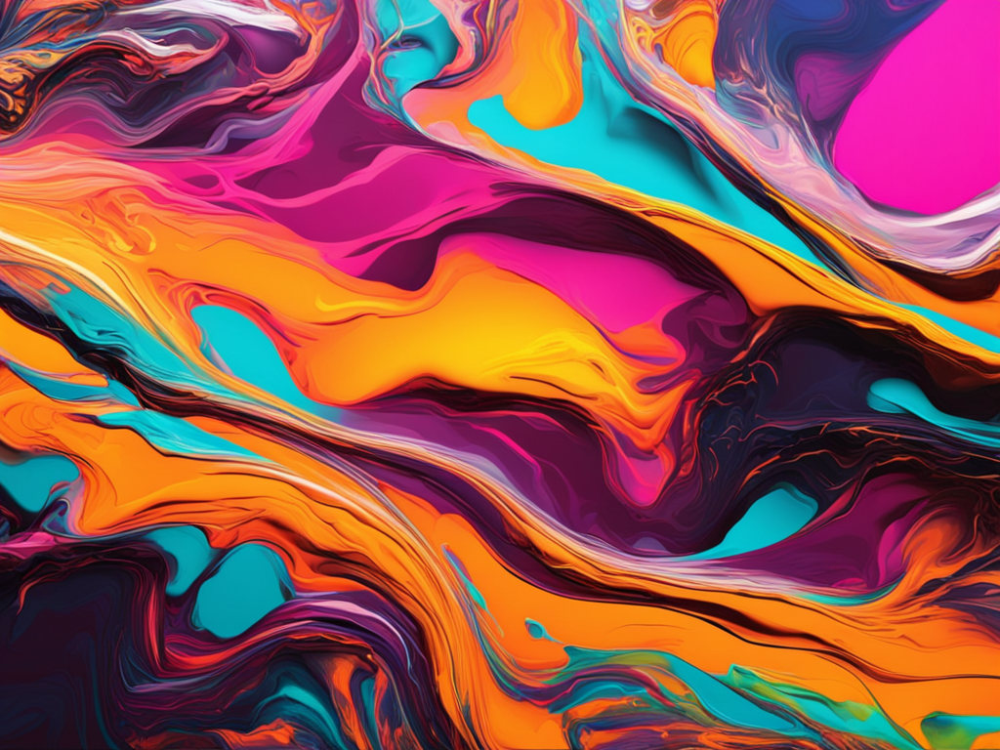
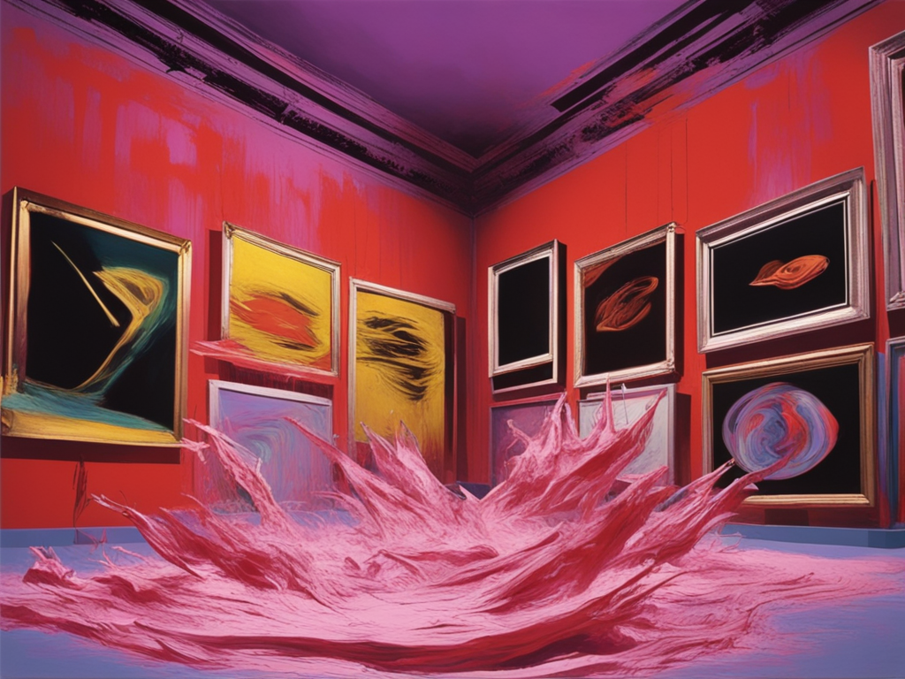

# hallucinate





### about

using generative ai image-to-video ML to hallucinate extended video sequences from a single source image.

you will need an API key from [replicate.com](https://replicate.com)  exported as an environment variable.

### dependencies

tested on [debian linux](https://www.debian.org/)

this requires [ffmpeg](https://ffmpeg.org/)

this costs money to run *see [replicate.com](https://replicate.com) pricing

put your images in the ./images folder. mp4 output is in the output folder.

```sh
sudo apt-get install ffmpeg
git clone https://github.com/m-onz/hallucinate
npm i
export REPLICATE_API_TOKEN=r8_BRU**********************************
node hallucinate.js
```

wait a long time!

### generating initial images

You can add images to the `images` folder from any source. I used [this model](https://replicate.com/bamburaistudio/paper-texture)

With the prompt:

```
shocking abstract 3D art in the style of andy warhol and francis bacon for a gallery that shocks the viewer exploring digital, glitch and modern culture, distorted abstract wireframe mesh forms
```

You can also update the `hallucinate.js` script to configure the image-to-video model:

```js
const output = await replicate.run(
  "ali-vilab/i2vgen-xl:5821a338d00033abaaba89080a17eb8783d9a17ed710a6b4246a18e0900ccad4",
  {
    input: {
      image: dataURI,
      prompt: "shocking abstract 3D art in the style of andy warhol and francis bacon for a gallery that shocks the viewer exploring digital, glitch and modern culture, distorted abstract wireframe mesh forms",
      max_frames: 33
    }
  }
);
```

### generate gifs

You can use [this model](https://replicate.com/fofr/toolkit) to generate a .gif from an .mp4 video.

### more info

[This is blog article I wrote](https://m-onz.net/articles/command-line-audio-visual-art.html) on making command line visual art that might be useful.
